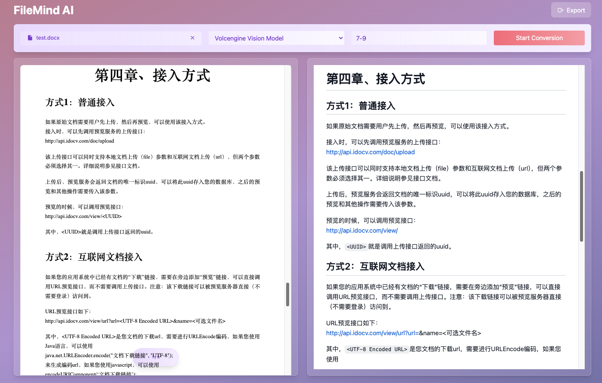

# FileMind AI

FileMind AI is an advanced document conversion tool that leverages AI technology to transform various document formats into Markdown or Word documents. It provides intelligent text recognition and formatting preservation, making it an ideal solution for document conversion and content extraction.



## Key Features

### Intelligent Document Processing
- Advanced AI-powered OCR technology
- Multiple AI model support for optimal recognition
- Accurate text and layout recognition
- Format preservation during conversion

### Comprehensive Format Support

#### Input Formats
- PDF documents
- Microsoft Office files (Word, Excel, PowerPoint)
- Image files (JPG, PNG, GIF, BMP, TIFF, WebP)
- Web documents (HTML, XML)
- Text files (TXT, RTF)

#### Output Formats
- Markdown (.md)
- Microsoft Word (.docx)

### User-Friendly Interface
- Modern, intuitive web interface
- Real-time document preview
- Drag-and-drop file upload
- Page selection for partial document conversion
- Export options for different formats

## Getting Started

### Prerequisites
- Python 3.7 or higher
- Git (for cloning the repository)

### Installation

1. Install Python (3.8 or higher)
   ```bash
   # Download from https://www.python.org/downloads/
   # Make sure to check "Add Python to PATH" during installation
   ```

2. Install system dependencies
   ```bash
   # macOS (using Homebrew)
   brew install libreoffice
   brew install graphicsmagick
   brew install poppler
   
   # Linux (Ubuntu/Debian)
   sudo apt-get install libreoffice
   sudo apt-get install graphicsmagick
   sudo apt-get install poppler-utils
   
   # Windows
   # Download and install:
   # - LibreOffice: https://www.libreoffice.org/download/
   # - GraphicsMagick: http://www.graphicsmagick.org/download.html
   # - Poppler: https://github.com/oschwartz10612/poppler-windows/releases/
   #   After downloading Poppler, add its 'bin' directory to your system PATH
   ```

3. Create virtual environment
   ```bash
   # Create venv
   python -m venv venv
   
   # Activate venv
   # Windows
   venv\Scripts\activate
   # macOS/Linux
   source venv/bin/activate
   ```

4. Install Python dependencies
   ```bash
   pip install -r requirements.txt
   ```

### Running the Application

1. Start the application:
   ```bash
   python main.py
   ```

2. Access the web interface:
   - Open your browser
   - Navigate to http://localhost:8000

### Using the Application

1. Convert Documents
   - Upload a document using drag-and-drop or file selection
   - Choose an AI model from the available options
   - Optionally specify pages to convert (e.g., "1,2,3" or "1-5")
   - Click "Start Conversion" to begin the process

2. Export Results
   - Preview the converted content in real-time
   - Copy the Markdown content directly
   - Download as Markdown file
   - Export to Word document

## System Requirements
- Python 3.7 or higher
- Modern web browser
- Internet connection for AI model access

## Acknowledgments
- Thanks to all the open source projects that made this possible
- Special thanks to the AI model providers

## License
This project is licensed under the MIT License - see the LICENSE file for details.